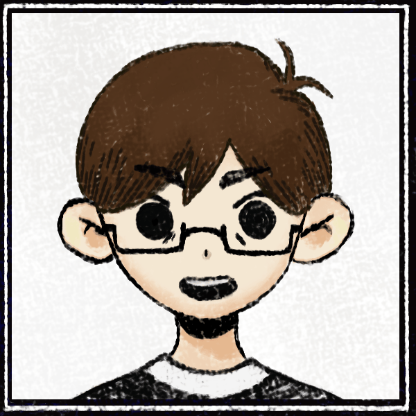

## Olá, eu sou o Carlos 👋

🎓 Estudante de Engenharia de Software

💡 Gosto de criar projetos que unem criatividade e sistemas

📚 Sempre buscando aprender algo novo e colocar a mão na massa

🌎 Estudando inglês e buscando me conectar com pessoas de diferentes países

🤝 Aberto a trocar conhecimento e colaborar em projetos interessantes

📬 Entre em contato comigo pelo LinkedIn ou GitHub

  
  

  

## 

  
  
  
  
  
  

  
  
  

